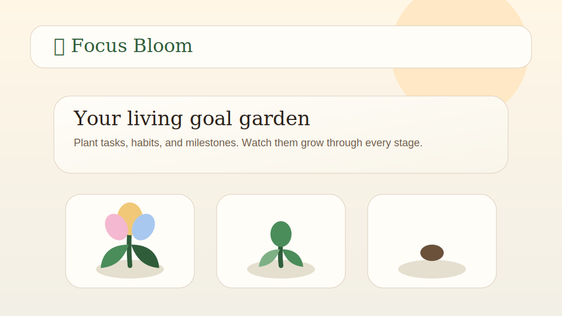

# Focus Bloom

A local-first **goal garden** where your habits, tasks, and milestones grow into living plants. No accounts, no cloud, no tracking — just a quiet, beautiful place to tend your intentions.

> _"Tend the garden, not the weeds."_



---

## Why Focus Bloom?

Most goal-tracking apps treat your ambitions like rows in a database. Focus Bloom treats them like seeds. Every habit, project, or milestone you create is planted in your garden, and it grows visibly as you make progress — from a buried **seed**, to a tender **sprout**, to a leafy **bud**, to a full **bloom**, and finally to a fruiting **harvest**.

Because everything lives in your browser's localStorage, your garden is private, fast, and yours. Export it as JSON whenever you want, and bring it back later.

## Features

- **Garden view** — every goal is a hand-drawn SVG plant card that visually reflects its current life stage
- **Five growth stages** — seed → sprout → bud → bloom → harvest, each with its own art
- **Three plant kinds** — habits, tasks, and milestones, each with distinctive silhouettes
- **Categories** — health, learning, creative, work, relationships, mindfulness — color-coded
- **Progress tracking** — log progress with a single click; the plant grows in real time
- **List & garden views** — toggle between a focused list and the full garden tableau
- **Filters & stats** — see what's blooming, what needs water, and how your week is going
- **Sample garden** — a thoughtful starter garden so the app feels alive on first run
- **Import / export / backup** — your data is JSON, and you own it
- **Keyboard shortcuts** — designed to feel fast under your fingers, with a built-in help overlay
- **Quick actions** — replant the sample garden, clear the current browser garden, or plant a new goal instantly
- **Garden Coach** — a deterministic recommender (`js/coach.js`) that scores every plant for "tend me next" urgency and explains *why*, so the suggestion is auditable instead of mysterious
- **Local-first** — no accounts, no servers, no tracking, no network calls

## Quick start

```bash
git clone https://github.com/<you>/focus-bloom.git
cd focus-bloom
# any static server will do, e.g.
python -m http.server 8000
# then open http://localhost:8000
```

Or simply open `index.html` directly in a modern browser. There is **no build step**.

The pure logic modules ship with a small Node-native test suite:

```bash
npm test  # runs node --test against tests/
```

## Keyboard shortcuts

| Key | Action |
|---|---|
| `n` | New goal |
| `g` | Switch to garden view |
| `l` | Switch to list view |
| `/` | Focus search |
| `e` | Export garden as JSON |
| `i` | Import garden from JSON |
| `?` | Show shortcut help |
| `Esc` | Close any open dialog |

## Data model

Every plant in your garden is a small JSON object:

```json
{
  "id": "g_xyz",
  "title": "Read 20 pages a day",
  "kind": "habit",
  "category": "learning",
  "stage": "bud",
  "progress": 14,
  "target": 30,
  "createdAt": "2026-04-01T08:00:00Z",
  "updatedAt": "2026-04-23T19:00:00Z",
  "history": [{ "at": "...", "delta": 1 }]
}
```

The full garden is just an array of these, persisted to `localStorage` under the key `focus-bloom:v1`.

## Stages, explained

| Stage | When you reach it |
|---|---|
| **Seed** | 0% — freshly planted, full of possibility |
| **Sprout** | 1–24% — first signs of life |
| **Bud** | 25–59% — visible structure, not yet open |
| **Bloom** | 60–99% — in full flower |
| **Harvest** | 100% — complete; the goal has fruited |

Habits without a target stay perennial — they cycle through stages each week so the garden keeps changing even after you've built the routine.

## Project structure

```
focus-bloom/
  index.html        # single-page shell
  styles/
    tokens.css      # design tokens (colors, spacing, type)
    app.css         # layout & components
    garden.css      # garden tableau styles
  js/
    store.js        # state + localStorage persistence
    model.js        # data model helpers (stages, ids, defaults)
    ui.js           # rendering, dialogs, list view
    garden.js       # SVG plant rendering, garden view
    seeds.js        # sample garden data
    io.js           # import/export helpers
    shortcuts.js    # keyboard handling
    coach.js        # deterministic "tend me next" recommender
    main.js         # bootstrap
  tests/
    coach.test.js   # node:test suite for coach.js
  docs/
    preview.svg     # hero image used in this README
```

## Privacy

Focus Bloom never makes a network request. Open your devtools and watch, there is nothing to watch. Your garden lives in `localStorage` and only travels when you choose to export it.

## License

[MIT](LICENSE) — do whatever you'd like, kindly.
